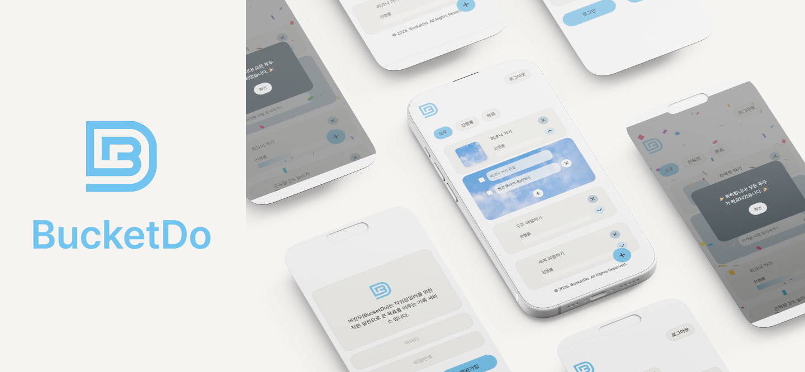
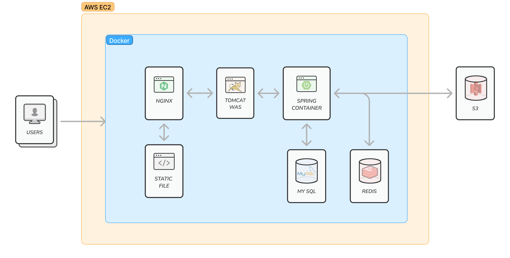
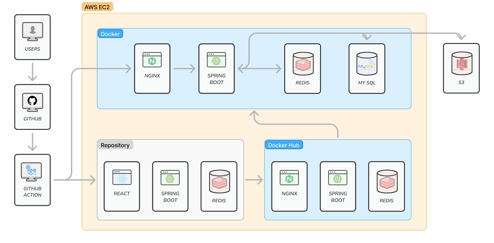
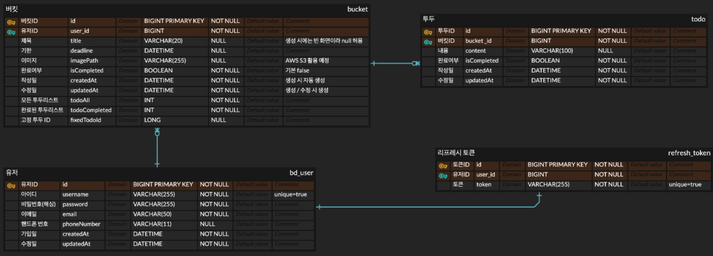
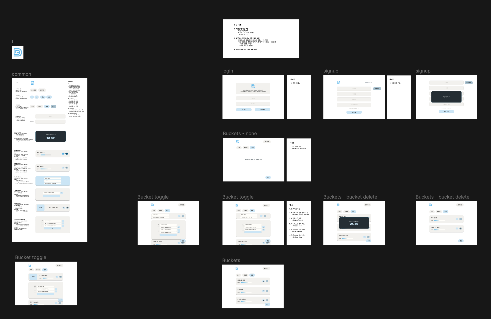

# 버킷 두(Bucket Do)

작심삼일러를 위한 "작은 실천으로 큰 목표 이루는" 기록 서비스 ✅

 

[🔗 BucketDo 바로가기](https://3.38.150.0.sslip.io/)

 

## 📖 프로젝트 소개

장황한 계획을 이루지 못하는 작심삼일러를 위해, 세분화된 투두 리스트 실천으로 버킷 리스트를 이루는데 도움을 주는 기록 서비스입니다.

사용자가 이루고 싶은 큰 목표를 작은 목표들로 나누어 달성률을 높일 수 있도록 하였습니다. 계획을 세워놓기만 하고 실천하지 않는 이유는 무엇일까요 ? 너무 큰 계획을 세우지는 않았나요 ? 큰 목표만 생각하면 달성하기 어려워 질 수 있습니다. 버킷두를 통해 작은 계획으로 세분화하되, 이를 하나씩 이루어가는 것은 어떨까요 ?

“천천히, 하나씩, 당신은 할 수 있어요 !”

 

## ✨ 주요 기능

| 기능        | 설명                                                                        |
|-----------|---------------------------------------------------------------------------|
| 회원가입      | 아이디, 이메일, 비밀번호 입력으로 사용자 정보가 등록됩니다.                                        |
| 로그인       | 사용자 인증 정보를 통해 로그인합니다.                                                     |
| 버킷 리스트 생성 | 버킷 리스트를 생성합니다.                                                            |
| 버킷 리스트 수정 | 버킷 리스트의 제목과 이미지를 수정합니다.                                                   |
| 버킷 리스트 조회 | 버킷 리스트의 진행도에 따라 목록을 조회합니다.                                                |
| 버킷 리스트 삭제 | 생성한 버킷 리스트를 삭제합니다.                                                        |
| 투두 리스트 생성 | 버킷 리스트의 하위 투두 리스트를 생성합니다.                                                 |
| 투두 리스트 수정 | 투두 리스트의 내용을 수정하고, 체크박스를 표시합니다. 모든 투두 리스트를 체크할 경우, 버킷 리스트는 완료 처리가 됩니다. |
| 투두 리스트 조회 | 버킷 리스트의 토글 버튼을 클릭해 해당 버킷 리스트의 투두 리스트 내용을 조회합니다.                           |
| 투두 리스트 삭제 | 투두 리스트를 삭제합니다.                                                            |

 

## ⚒️ 기술 스택

- **Frontend** : React 19, Redux 9.2, Axios 1.7
- **Backend** : Spring Boot 3.4.3, Java 21, MySQL 8
- **Infra** : Docker, AWS EC2, AWS S3, GitHub Action
- **Tool** : Figma, Notion, Jira, GitHub

 

## 🏗️ 아키텍처

### 서비스 아키텍처

### CI / CD

### ERD 설계도

### 와이어프레임

 

## 👥 팀 소개

| Frontend | Frontend | Backend | Backend | Backend |
| --- | --- | --- | --- | --- |
|  |  |  |  |  |
| [원성준](https://github.com/sungjoon92) | [임수빈](https://github.com/imdla) | [서승덕](https://github.com/ssdeok) | [이상호](https://github.com/steve0312) | [정명훈](https://github.com/wag192625) |

 

## 📝 문서

| 📃 리소스 | 🔗 링크 | 설명 |
| --- | --- | --- |
| 팀 노션 | [Notion 링크](https://www.notion.so/BucketDo-19d8cf3b3b228052a204e7b2f8f40099?pvs=21) | 프로젝트 계획 및 일정 관리 |
| 피그마 디자인 | [Figma 링크](https://www.figma.com/design/QM8vJ0pEPeqOPIAi6CDCde/%EB%94%94%EC%9E%90%EC%9D%B8-%EC%84%A4%EA%B3%84?node-id=0-1&t=Pm5B6xXHu8BQp6X8-1) | UI / UX 디자인 |
| Jira 백로그 | [jira 링크](https://bucket-do.atlassian.net/jira/software/projects/BD/boards/1/backlog?epics=visible&atlOrigin=eyJpIjoiOTliMThlZDg1YTUzNDNkMzhhNDk5NWE2MTBhMjg2NzIiLCJwIjoiaiJ9) | 프로젝트 개발 프로세스 관리 |